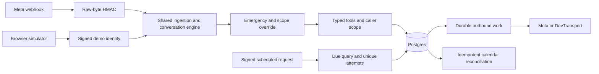

# Architecture

Frontdesk schedules appointments for a fictional clinic. Raw inbound text is never placed in database rows, logs, model prompts, or calendar events. Conversation state is an allowlisted logistics frame. Patient names are a fixed demo alias.

## Same engine after authentication

The browser constructs the same entry/change/message JSON shape as Meta. Both routes call the same process and ingest functions. The simulator has its own HMAC identity token and can only use its assigned synthetic recipient. It cannot impersonate an arbitrary caller or change the target clinic. Simulator delivery always uses DevTransport even when a real Meta token exists.

The API uses async routes for reading webhook bodies and offloads transactional processing to a thread pool. SQLModel sessions are short-lived and never shared between threads. Every inbound event reloads its conversation from Postgres.

## Transactions and overlap

A transaction-level advisory lock serializes a clinic/caller conversation, including first creation. The message identifier has a unique constraint. Tools, conversation state, incoming audit row and outgoing work commit together.

Slot claims lock the provider before the slot with SKIP LOCKED. The provider lock protects overlapping rows for different service types; a slot-level lock alone would not. A partial unique booking index adds a database backstop. Rescheduling locks affected providers in sorted order, updates both slots, and moves the booking in one transaction. Cancellation locks the booking and provider before freeing its slot.

Strict scope checks cover clinic, conversation and owner inside tools. Calendar, reminder and outbox workers deliberately enumerate clinics, then scope each resource lookup. Ops access uses a shared demo operator token.

## Time

Business hours are local, stored timestamps are aware UTC. Slot generation converts opening and closing boundaries to UTC, then advances in actual elapsed time. Repeated fall hours have different UTC identities. The customer service window is a half-open interval: the closing instant requires a template. Inbound delivery timestamps do not extend the session to receipt time.

## External effects

Outbox work is committed before dispatch. A worker claims pending work with a row lock, writes sending, then calls the transport. A timeout becomes unknown and is never automatically retried. A crash while sending leaves sending for review. This is at-most-once automatic send attempts, not a false promise of exactly-once external delivery.

Google events use the booking UUID without hyphens as their stable ID. Insert conflicts become updates; repeated deletes tolerate missing events. Calendar jobs are independently retryable and never roll back a committed booking.

Reminder requests sign timestamp plus nonce. The timestamp has a bounded acceptance period and the nonce is unique in Postgres. Concurrent reminder queries are serialized, and each booking/threshold pair has a unique attempt row. Reminders always use a template.

## Optional model

The offline policy is the default. Optional LiteLLM planning only receives a closed set of logistics intent labels. It cannot receive raw input or invent tool arguments. It selects a grounded intent; the deterministic policy still drives tools and confirmations. A conservative token-cost reservation is checked before each request. API reservations persist in Postgres across restarts. No live model call was measured.

## Evidence

Tests use Postgres via testcontainers. A synthetic relational snapshot preserves the audit tables behind the measured record. Importing evidence uses conflict-aware inserts and never removes existing rows. The claim renderer queries Postgres, verifies archived scenario replays against actual message rows, computes summary tables and re-renders entire documents. Empty or incomplete evidence fails closed.

The local browser walkthrough is a recording of this system using DevTransport. It is not a recording of WhatsApp on a real device.

## Public review without a live backend

The Pages build is a static evidence explorer. Its public JSON is rendered only after the database claim gate checks the archived source rows and independently rescores the scenarios. A snapshot digest identifies the exact relational evidence behind the page. The public exporter excludes operational tables, clinic/conversation identifiers and recipient fields from tool arguments.

The explorer offers search, category filters, stepped audit replay, expected-versus-observed calls, and links from design decisions to implementation and tests. It does not execute a second booking engine or make live API calls. The normal local build retains the original API-backed simulator and operations console. This separation makes recruiter review reliable without inventing a live integration claim.
