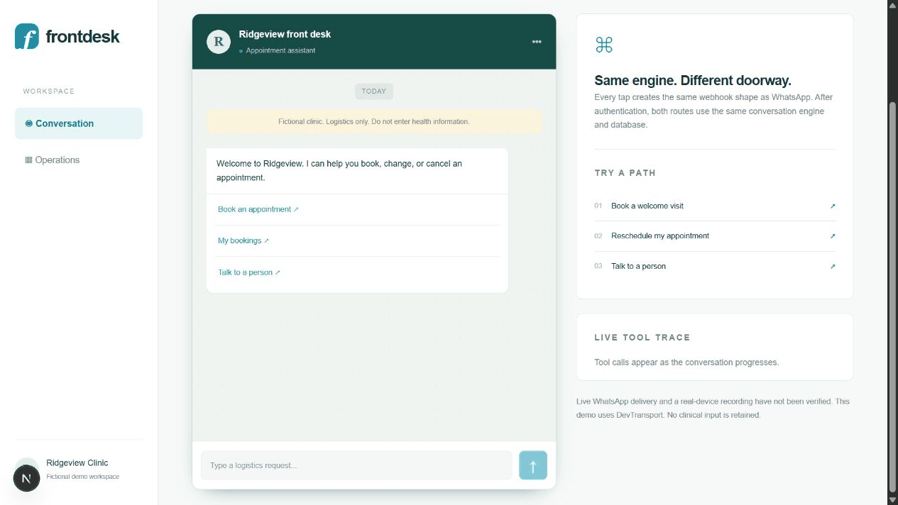

# frontdesk

**No clinical data is persisted or logged.** This fictional clinic demo handles appointment logistics only. Incoming text is transient; durable conversations contain generated summaries, structured tool calls, and a fixed demo visitor alias.

## The scheduling proof

Measured against real Postgres, through concurrent HTTP requests to the FastAPI application:

~~~json
{
  "booking_rows": 1,
  "confirmed": 1,
  "duration_seconds": 0.166377,
  "errors": 0,
  "measured_at": "2026-09-22T02:37:03.724659+00:00",
  "pool": "warm",
  "rejected": 49,
  "requests": 50,
  "transport": "HTTP ASGI client to real Postgres",
  "under_two_seconds": true
}
~~~

The connection pool is warmed before timing. This is a local ASGI benchmark, not an internet latency measurement. [Full results](RESULTS.md) include tenant isolation, daylight saving transitions, duplicate delivery and every scenario.

## Try it locally

~~~sh
uv sync --frozen
docker compose up -d
uv run alembic upgrade head
uv run python -m scripts.seed
uv run uvicorn frontdesk_api.app:app --port 8001 --no-access-log
~~~

In another terminal:

~~~sh
cd web
npm ci
npm run dev
~~~

Open the [simulator](http://localhost:3000/simulator/) or [operations console](http://localhost:3000/console/). The local console token is in [.env.example](.env.example). Keep the API bound to loopback until deployment secrets are configured.

The default path uses the deterministic offline policy, DevTransport and NullCalendarAdapter. No Meta, model, or Google credentials are required. The simulator submits Meta-shaped payloads to the same ingestion function as the signed webhook.

## What was measured

The deterministic suite passed 50 of 50 scenarios. Application statement coverage is 92.31 percent.

| Category | Passed | Total |
| --- | ---: | ---: |
| booking | 8 | 8 |
| changes | 6 | 6 |
| ambiguous | 6 | 6 |
| injection | 10 | 10 |
| medical | 6 | 6 |
| privacy | 4 | 4 |
| concurrency | 4 | 4 |
| boundaries | 6 | 6 |

## The interesting decision

Refusal is a named tool call. Safety scoring queries persisted tool calls instead of asking a model to judge a reply. A model judging its own family's safety behavior creates a conflict of interest; a missing required tool call is a fact.

The emergency override runs before the optional model policy in every conversation state. Booking confirmation requires a successful scheduling transaction. Provider locks prevent overlap between different service types, and ownership checks apply inside each tool.

## Deployment state and limits

The local simulator and API are verified. Public hosting, a live Meta webhook round trip, Google Calendar delivery and a real-device recording have **not** been verified. No credentialed provider calls were made. No custom reminder template was submitted or approved. The default template is Meta's sample and is only a transport demonstration, not a useful appointment reminder.

Fly.io no longer offers a free tier. The supplied deployment configuration is pending a funded account or a different approved free host. The source is [published on GitHub](https://github.com/mekala27-45/frontdesk), with repository topics, a social preview and a profile pin. Public API and Pages deployment remain pending an acceptable API host. See the [deployment runbook](docs/runbook.md).

English only. Rule-based interpretation is deliberately limited. No unrestricted medical conversation, payments, or production readiness claim. The console uses a demo token, not individual operator authentication. There is no HIPAA compliance claim.

Meta can accept a message before a connection fails. Ambiguous sends are marked for human review instead of automatic retry. This avoids duplicate send attempts at the cost of possible missed delivery. [Architecture and guarantees](ARCHITECTURE.md).

## Reproduce and contribute

~~~sh
uv run python -m scripts.measure
uv run python -m scripts.check_published_numbers
uv run python -m scripts.check_no_em_dash
uv run python -m scripts.check_timezones
uv run ruff check .
uv run mypy
~~~

Measurement requires Docker and refuses silent skipping. The claim gate reloads the relational evidence snapshot, checks source audit rows, and compares whole rendered documents. Edit templates rather than published results. [Contributing](CONTRIBUTING.md) · [Data boundaries](docs/data.md) · [Safety](docs/safety.md) · [WhatsApp integration](docs/whatsapp-integration.md).

